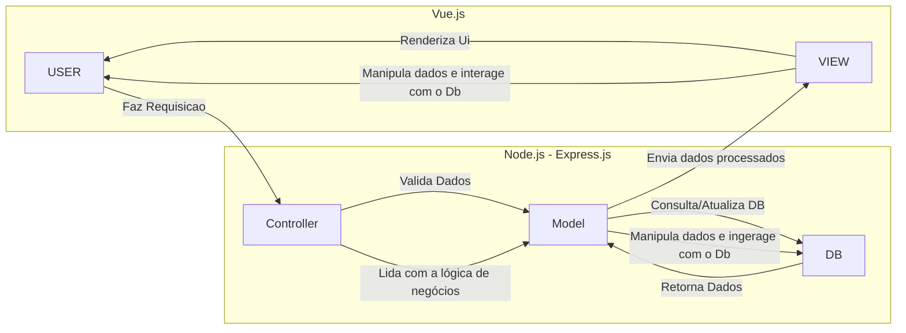
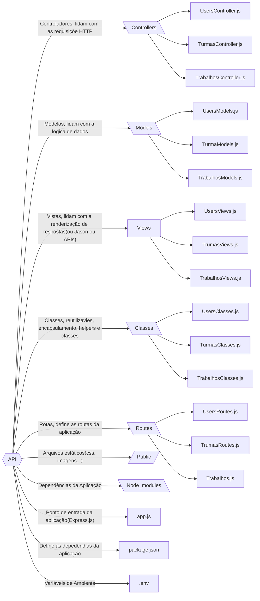

# AmostraCientica

## API: MVC

### Explicação da Arquitetura:
**Usuário (User):** O fluxo começa quando o usuário faz uma requisição à aplicação, geralmente através de interações na interface de usuário (frontend Vue.js).

**Controller (Controlador):** O controlador, que faz parte do backend no Express.js, é responsável por receber as requisições do usuário. Ele interpreta a requisição (por exemplo, uma requisição de GET, POST, etc.), valida os dados e decide o que fazer. Em termos de POO, ele seria como uma "classe" que gerencia a lógica de requisições.

**Model (Modelo):** O controlador envia os dados recebidos para o Model, que é responsável por acessar ou modificar o banco de dados (MySQL). O modelo contém a lógica de negócios relacionada aos dados e interage diretamente com o banco.

**MySQL (Banco de Dados):** O banco de dados armazena as informações estruturadas da aplicação, como registros de usuários, produtos, etc. O Model se comunica com o MySQL para obter ou salvar dados.

**View (Visão):** Depois que o Model retorna os dados processados ao Controller, o controlador formata esses dados e envia uma resposta para a View (Vue.js). A View é a interface visual que o usuário vê e interage, e ela renderiza as informações recebidas do backend.

**Usuário:** O fluxo termina quando a View renderiza as informações na tela para o usuário, que pode interagir novamente com a aplicação, fechando o ciclo.

